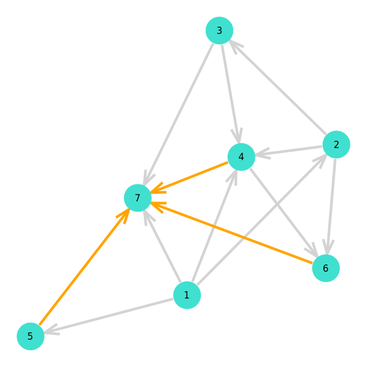

# Plotting

Plotting MCF problems is done by using the _GraphPlot.jl_ package. A plot can be generated through use of the [`mcfplot(pb::MCF, layout::Function=spring_layout)`](@ref) function. 

```julia
julia> pb = load("instances/toytests/test1/", edge_dir=:single)
MCF(nv = 7, ne = 10, nk = 3)
	Demand{Int64, Int64}(1, 7, 5)
	Demand{Int64, Int64}(2, 6, 5)
	Demand{Int64, Int64}(3, 7, 5)

julia> # draw and save figure

julia> draw(PNG("test1.png", 16cm, 16cm), mcfplot(pb))
```



## Index

```@index
Pages = ["mcf_plot.md"]
```

## Full docs

```@autodocs
Modules = [MultiFlows]
Pages = ["mcf_plot.jl"]

```

