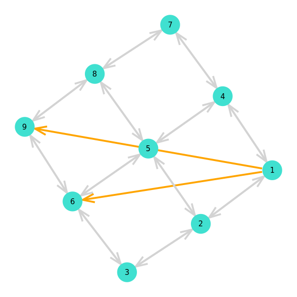
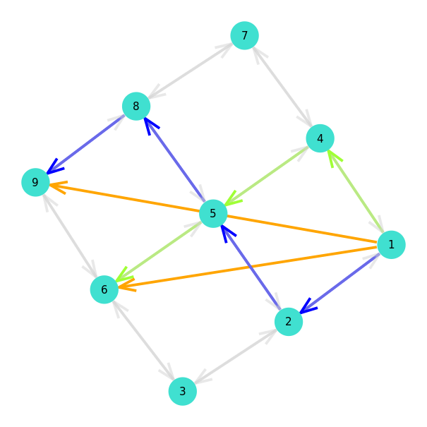

# Solving Compact Formulation

Solving Compact Formulation with state of the art LP solver. Interfacing with solver is done using the _JuMP.jl_ package.

First define a simple MCF problem : 
```julia
julia> using Graph, MultiFlows

julia> g = grid((3,3))
{9, 12} undirected simple Int64 graph

julia> pb = MCF(gr, ones(ne(g)), ones(ne(g)), [Demand(1,9,1.0), Demand(1,6,1.0)])
MCF(nv = 9, ne = 24, nk = 2)
	Demand{Int64, Float64}(1, 9, 1.0)
	Demand{Int64, Float64}(1, 6, 1.0)

julia> solve_compact(pb)
MCFSolution
	Demand k = 1
		1.0 on VertexPath{Int64}([1, 2, 5, 8, 9])
	Demand k = 2
		1.0 on VertexPath{Int64}([1, 4, 5, 6])

```

Problem                    |  Solution
:-------------------------:|:-------------------------:
  |  

## Index

```@index
Pages = ["compact_solver.md"]
```

## Full docs

```@autodocs
Modules = [MultiFlows]
Pages = ["compact_solver.jl"]

```

