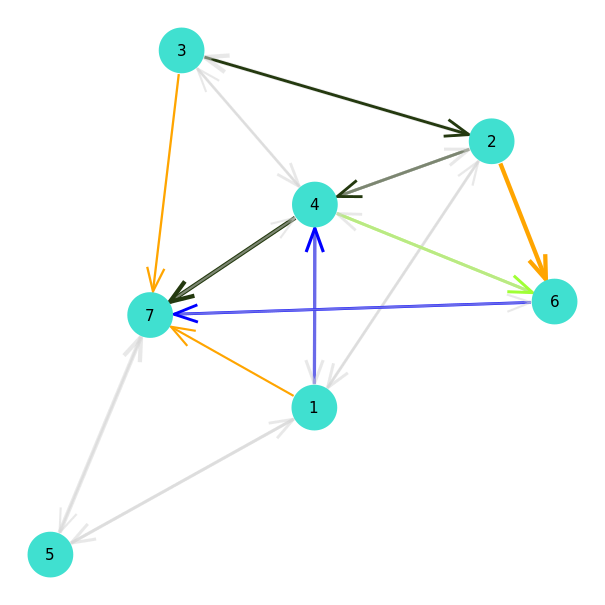

# Plotting

Plotting MCF problems is done by using the _GraphPlot.jl_ package. A plot can be generated through use of the [`mcfplot(pb::MCF, layout::Function=spring_layout)`](@ref) function. 


## Instances 

```julia
julia> pb = load("instances/toytests/test1/", edge_dir=:single)
MCF(nv = 7, ne = 10, nk = 3)
	Demand{Int64, Int64}(1, 7, 5)
	Demand{Int64, Int64}(2, 6, 5)
	Demand{Int64, Int64}(3, 7, 5)

julia> # draw and save figure

julia> draw(PNG("test1.png", 16cm, 16cm), mcfplot(pb))
```


## Solution

It is possible to use `MultiFlows.graph_with_demand_edges(pb::MCF)` to create a directed graph with edges added between demand endpoints. This can be usefull when generating layout locations and drawing consistent problem and solution plots.

```julia
julia> using GraphPlot

julia> g = MultiFlows.graph_with_demand_edges(pb)
{7, 23} directed simple Int64 graph

julia> loc_x, loc_y = spring_layout(g);
```

We can now plot the graph with solution edges outlined : 
```julia
julia> draw(PNG("test1_solution.png", 16cm, 16cm), mcfsolplot(sol, pb, loc_x, loc_y))
```



Note that `mcfsolplot` can also be called without the `loc_x,loc_y` arguments : `mcfsolplot(sol, pb)`. 

## Index

```@index
Pages = ["plot.md"]
```

## Full docs

```@autodocs
Modules = [MultiFlows]
Pages = ["plot.jl"]

```

