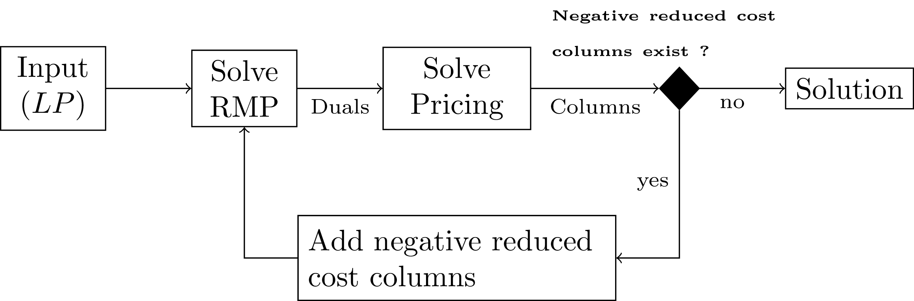

# Column Generation

```@raw html


```


```@eval
ENV["GKSwstype"] = "100"
ENV["LD_LIBRARY_PATH"] = ""
push!(LOAD_PATH, "../../..")
using JuMP, Plots, MultiFlows
pb = load("../../../instances/toytests/test1")
objvals = []
function rmpcallback(rmp)
    push!(objvals, JuMP.objective_value(rmp.model))
end
solve_column_generation(pb, rmp_solve_callback=rmpcallback)
savefig(plot(1:size(objvals,1), objvals, xlabel="Iteration", ylabel="Objective"), "callback_toytest1_cg.png")
nothing
```


## Index

```@index
Pages = ["column_generation.md"]
```

## Full docs

```@autodocs
Modules = [MultiFlows]
Pages = ["column_generation.jl"]

```

