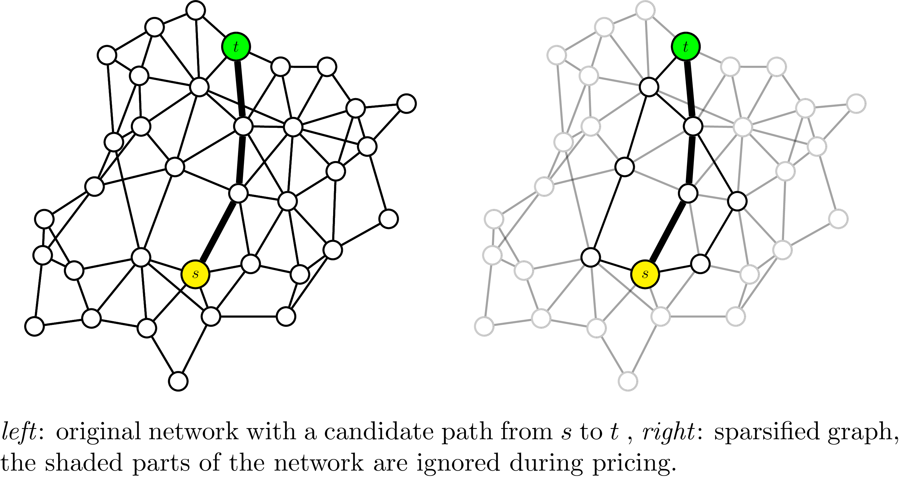
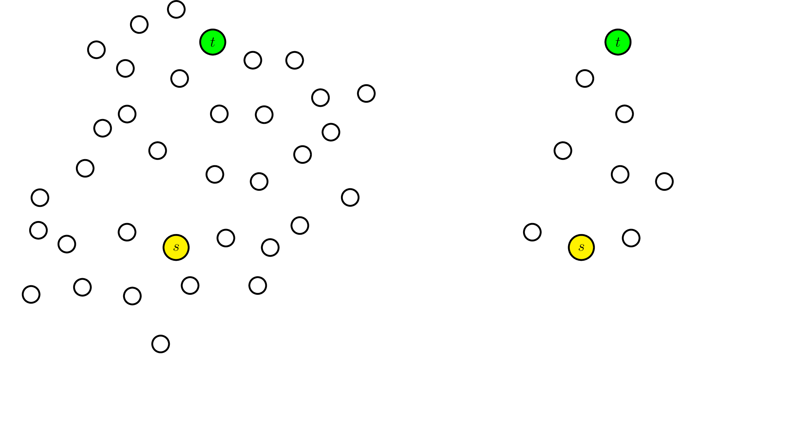

# MCF Sparsification

## Index

```@index
Pages = ["sparsify.md"]
```


Sparsification if the process of identifying variables that can be eliminated from the problem resulting in a smaller model that is easier to solve than the original. MCF solutions are notorious for using a very small portion of the graph from routing the demands, i.e. many of the arc-demand variables ``x_a^k`` have zero value. Properly identifying regions of the graph that either have very small or very important probability of belonging to the solution can lead to a significant increase in solver performance, but in general this is not an easy task. 

We call a **sparsifier** a function ``\gamma`` taking as input an MCF instance ``\mathcal{I}`` defined over graph ``G=(V,A)`` and with demands ``K``. The sparsifier outputs a ``0-1``-matrix ``S = (s_{ka})_{k\in K, a\in A} := \gamma (\mathcal{I}) `` of dimension ``|K| \times |A|`` where ``S_{ka} = 0`` means that variable ``x_a^k`` can be set to ``0``.

The _MultiFlows.jl_ package offers a general framework for defining such sparsifier and integrating them into MCF problem solvers. Applications of sparsification include : 
- reducing the size of the compact formulation model
- sparsifying the pricing problem in column generation

```@raw html


```


## Compact formulation reduction
The **Sparse Compact Formulation** of an MCF problem is defined as in [Arc-flow formulation](@ref) where additional constraints are added : 
```math
x_a^k = 0 \quad \forall k \in K, a\in A, s_{ka} = 0
```

The resulting problem is solved using state of the art solvers. 

## MCF Pricing sparsification
For MCF problems the pricing problem involes searching for each demand ``k`` a shortest-path. Although shortest-paths algorithms are efficient they may spend unnecessary time visiting parts of the graph that could not possibly belong to the solution. Reducing the graph size for each demand such that it only contains promising arcs can lead to performance increase without degrading the quality of the solution.

Given a demand ``k`` we define the **sparse graph** ``G_k = (V, A_k)`` where ``A_k = \{a \in A | s_{ka} = 1 \}``. ``G_k`` is then used for solving the pricing problem. 

## Sparsification methods
Some sparsification techniques that we have implemented : 
- SP sparsification : for each ``k`` we set ``s_{ka} = 1`` if ``a`` belongs to at least one of the ``L`` ``s_k,t_k``-shortest-paths. This requires either computing at solve time ``L`` shortest-paths for each demand or knowing such paths in advance.
- ML sparsification : an sparsification model can be trained by supervised learning to approximately identify promising parts of the graph. 


## Full docs

```@autodocs
Modules = [MultiFlows]
Pages = ["sparsify.jl"]

```

